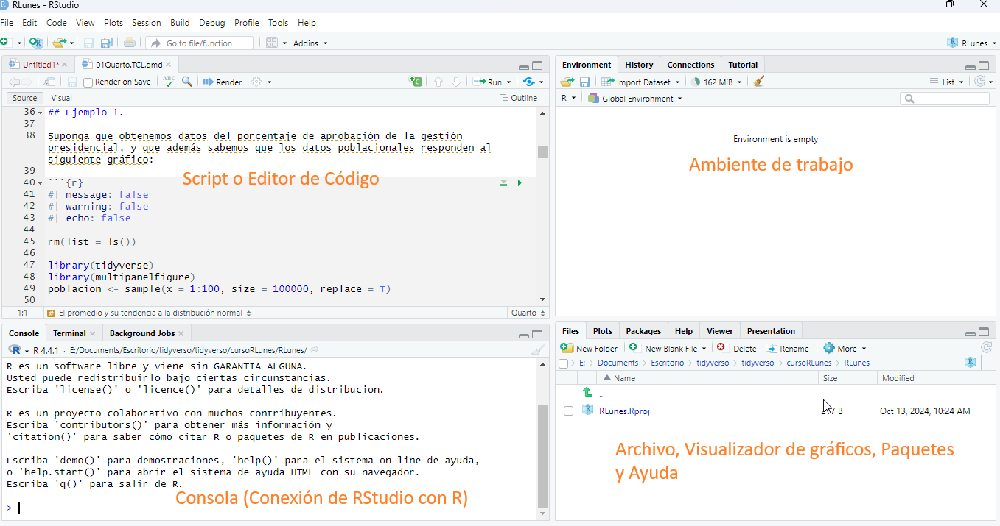
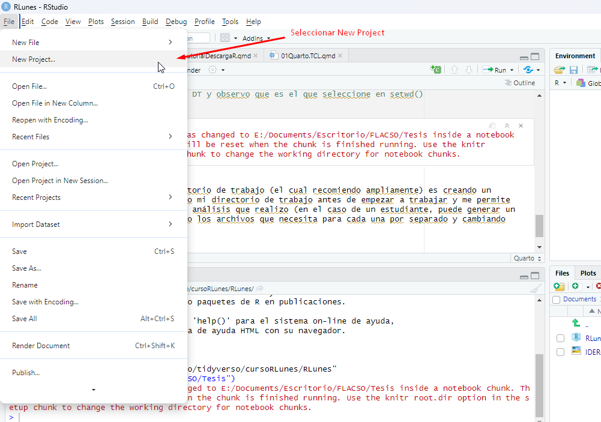
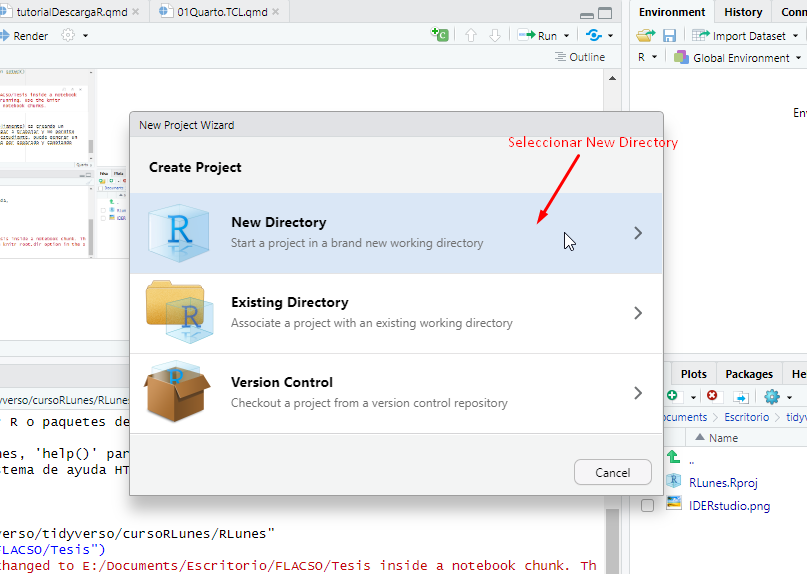
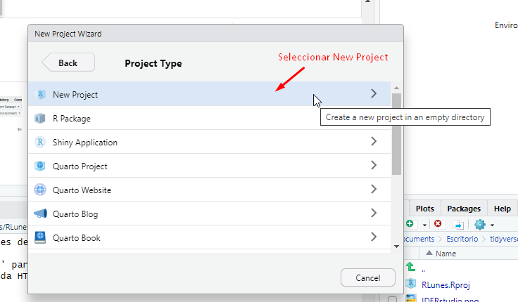
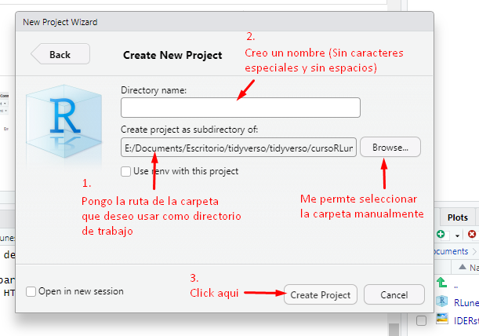
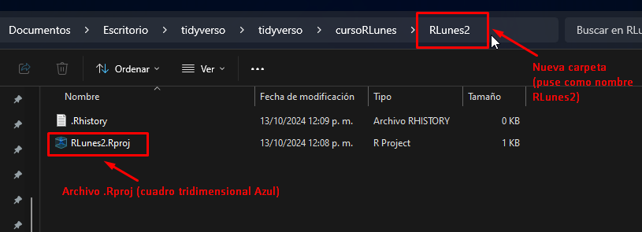
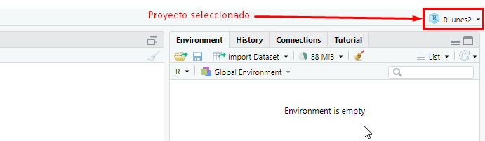

## ¿Por qué programar en R?

- Es software libre.
- Es una habilidad que ha tomado relevancia y ha empezado a ser valorada en el mercado laboral, sobre todo en nuevos nichos vinculados al análisis de datos y a la ciencia de datos.
- En el mundo académico es el software más utilizado para generar evidencia empírica cuantitativa.
- En R es posible garantizar la replicabilidad de mis estudios y análisis.
- Sí son muchos datos el Excel no alcanza.
- Puedo automatizar procesos.
- La curva de aprendizaje en R depende del ususario, pero en general es mucho mas amigable que con lenguajes de programación similares como Julia o Python.
- La comunidad de R es mucho más estricta respecto a los estándares de calidad de las librerías, hay una revisión exhaustiva de su contenido antes de ser aceptadas en el repositorio CRAN (Comprehensive R Archive Network).

## Manejo de RStudio

### Los cuatro cuadrantes de RStudio

En general, en RStudio se trabaja con cuatro cuadrantes entre los cuales se distribuye la pantalla (imagen de abajo).



- **Script o Editor de código (cuadrante superior izquierdo):** El script es un documento en el que se almacena un conjunto sucesivo de ordenes que el software R debe realizar, puede ser solo código (archivo .R) o un documento que combina texto y código (archivos .qmd o .Rmd)
- **Consola (cuadrante inferior izquierdo):** Es el cerebro de mi RStudio, en la consola se refleja la ejecución de las ordenes de mi script, las cuales viajan al software R y nos devuelve un pantallazo de los resultados.
- **Ambiente de trabajo (cuadrante superior derecho):** R es un lenguaje de programación orientado a objetos, lo que significa que yo puedo nombrar y almacenar las operaciones u ordenes que ejecuto. En mi ambiente de trabajo puedo ver aquellas ordenes que he decidido almacenar con un nombre especifico, las cuales pueden ser llamadas o modificadas cada vez que lo considere necesario. Además, puede existir interacción entre dichos objetos.
- **Archivo y pantalla de visualización (cuadrante inferior derecho):** En este cuadrante puedo ver los archivos que tengo disponibles para trabajar, obtener una visualización previa de los gráficos que genero y consultar la documentación oficial de paquetes y funciones *(Help)*.

### Directorio de trabajo:

RStudio es una aplicación que interactúa no solo con R sino también con la memoria de nuestro equipo, por lo que debemos elegir el espacio del cual R y RStudio va a tomar los archivos que necesitamos procesar o analizar (bases de datos, imágenes, plantillas, etc.) y el espacio donde va a almacenar los resultados que obtengamos (tablas, gráficos, nuevas bases de datos, documentos, etc.). Este espacio es uno solo y se conoce como **Directorio de Trabajo (DT)**.

Para consultar el DT la función a utilizar es `getwd()`, tan solo escribiendo el nombre de la función (sin poner nada adentro de los paréntesis) obtengo la ruta al espacio de la memoria de mi equipo que RStudio está utilizando.

```{r}

rm(list = ls()) # Expresión para limpiar el ambiente de trabajo

getwd() # Función para consultar el directorio de trabajo

```

Si deseo modificar mi DT, porque existe una carpeta especifica la cual cree para trabajar en RStudio, por ejemplo, una carpeta en la cual estoy almacenando las bases de datos que necesitó para mi proyecto de investigación. La función a utilizar es `setwd()`, dentro de los paréntesis, debo poner entre comillas la ruta de la carpeta que deseo utilizar.

```{r}

# setwd("E:/Documents/Escritorio/FLACSO/Tesis") # Función para cambiar el DT

getwd() # Vuelvo a consultar el DT y observo que es el que seleccione en setwd()

```

::: {.callout-note appearance="simple"}
Cuando copias la ruta de la carpeta que deseas utilizar como directorio de trabajo, observaras que los slash están invertidos, R está configurado para reconocer el slash tradicional **("/")**, por lo que deberás cambiar cada uno de ellos.
:::

Otra manera de definir el directorio de trabajo (el cual recomiendo ampliamente) es creando un R-Project, de esta manera defino mi directorio de trabajo antes de empezar a trabajar y me permite tener más orden en cuanto a los análisis que realizo (en el caso de un estudiante, puede generar un R-Project por materia, manejando los archivos que necesita para cada una por separado y cambiando fácilmente entre proyectos).

#### Creación de un RProject

A continuación veras los pantallazos con los pasos para crear un ***RProject***.

##### Paso 1



##### Paso 2



##### Paso 3



##### Paso 4



##### Paso 5

Verifico que se creó al observar entre mis archivos una nueva carpeta con el nombre que yo asigne y un cuadrito tridimensional azul con una ***R*** en el medio.



Además, en mi RStudio, en la esquina superior derecha, arriba de mi ambiente de trabajo, puedo observar el cuadrito tridimensional azul con el nombre del proyecto creado.



Una vez creado el proyecto, tengo la seguridad que al ejecutar `getwd()` voy a obtener como resultado, la ruta de la carpeta que yo seleccione previamente para trabajar.

Es importante el directorio de trabajo porque es donde voy a almacenar lo que necesito, no puedo cargar ningún archivo en RStudio si no está en mí directorio de trabajo, un mal manejo de este punto puede generar estrés y frustración por bloquear el inicio del análisis o de las tareas que vaya a realizar.

Habiendo revisado la manera de consultar y seleccionar el directorio de trabajo, pasemos ahora a la instalación y descarga de librerías o paquetes.

## Librerías o paquetes

Todo lo que se quiera hacer en R se puede hacer a partir de sus comandos más básicos, sin embargo, hacer las cosas de esa manera es poco práctico y restringiría el acceso a potenciales usuarios que no tienen el tiempo y el conocimiento para hacer las cosas de esa manera.\
Para ahorrar tiempo y hacer más comprensibles los procesos que requerimos, una comunidad de expertos ha desarrollado paquetes o librerías que contienen funciones, las cuales facilitan la comprensión del lenguaje y el flujo de trabajo.

Algunos paquetes vienen cargados de manera predeterminada en el software, por lo que no requieren ningún comando de instalación o activación, pero muchos paquetes o librerías útiles deben ser cargadas y activadas a partir de ordenes en nuestro script.

### Instalación de paquetes

Cualquier paquete requiere ser instalado solamente una vez, la función para instalar paquetes es `install.packages()`, dentro del paréntesis debe ir entre comillas el nombre del paquete que deseamos instalar.\
Un paquete muy utilizado para el análisis de datos es `{tidyverse}`, el cual contiene otros subpaquetes con distintas funcionalidades.\

Haz la prueba de instalación con este paquete, llevara 2 o 3 minutos pero es fundamental para lo que realizaremos posteriormente. Acá abajo el código, solo asegúrate de copiarlo sin el símbolo **\#** (este se utiliza para realizar comentarios y anula el código que se encuentra a su derecha, yo lo puse porque ya tengo instalado el paquete)

```{r}

# install.packages("tidyverse")

```

### Activación de paquetes

Una vez instalado el paquete para poder utilizarlo debes activarlo, esto se hace con la función `library()`, dentro de los paréntesis se pone el nombre del paquete o librería que deseamos utilizar (sin comillas). Esto debe realizarse en cada inicio de sesión en RStudio. Abajo el código

```{r}

library(tidyverse)

```

::: {.callout-note appearance="simple"}
- Instalación de paquetes solamente una vez Ej. `install.packages("tidyverse")`
- Activación de paquetes en cada inicio de sesión Ej. `library(tidyverse)`
:::

## Levantado de bases de datos

En general, todas las personas que han trabajado con algún tipo de base de datos, lo han hecho a través de excel o planillas de cálculo. Es una herramienta muy potente y ha conquistado el mundo administrativo, por lo que si estas en el sector privado, sabrás que la mayoría de las veces te pedirán un excel que contenga los resultados de tu análisis. Pero este no es el único formato y de hecho no es el más eficiente.

Además de los archivos **.xlsx**, están los archivos **.dta**, **.csv**, **.txt** y con la mayor difusión de R, no es extraño encontrar archivos **.RData** o **.Rds**

### Que es una base de datos?

Un arreglo ordenado de filas y columnas en el que las filas representan observaciones o unidades de análisis y las columnas representan las características o atributos de cada una de las observaciones. Es un objeto que almacena información.

### Como cargarlas en R?

Levantar una base de datos es muy sencillo, no excede una línea de código y existen paquetes que permiten cargar los distintos formatos de archivos.\
Para ver estas alternativas, exporte partes de la base de datos de Latinobarometro de 2023 en distintos formatos, cargaremos cada una de esas partes hasta armar la base de datos original.

::: {.callout-note appearance="simple"}
Los archivos **.xlsx** y **.dta** requieren algún tipo de paquete para ser cargados, el resto de formatos es posible cargarlos a partir de los comandos base de R
:::

Notaras que al cargar los archivos, todos tienen la ruta `bases/nombreDeLaBase`. Esto es porque dentro de mi directorio de trabajo cree una carpeta que contiene las bases de datos, para que puedas copiar el código tal cual, te recomiendo que hagas lo mismo, dentro de la carpeta que definiste como directorio de trabajo, crea una carpeta con el nombre de bases y almacena todas las bases en esta carpeta.\
En caso de que no quieras hacerlo, simplemente asegurate de cambiar la ruta dentro de los comandos `read`.

### Carga de base .txt

```{r}

base1 <- read.table(file = "bases/base1.txt")

```

### Carga de base .csv

```{r}

base2 <- read.csv(file = "bases/base2.csv")

```

### Carga de base .dta

Hay dos paquetes alternativos para cargar bases .dta, **{foreign}** y **{haven}**, estos paquetes contienen otras funciones que superan el alcance de este curso, por lo que es indiferente cual decidas utilizar.

```{r}

library(foreign)

base3 <- read.dta(file = "bases/base3.dta")

```

### Carga de base .xlsx

Para cargar bases que están almacenadas en formato excel también tienes varias alternativas, algunas de ellas son **{xlsx}** y **{readxl}**, yo recomiendo esta última.

```{r}

library(readxl)

base4 <- read_excel(path = "bases/base4.xlsx")

```

### Carga de base .RData

```{r}

load("bases/base5.RData")

```

Si ejecutaste los cinco comandos, ahora debes tener 5 bases de datos en tu ambiente de trabajo (cuadrante superior derecho), la base original a partir de la cual fueron generadas estas bases es **"Latinobarometro_2023_Esp_Stata_v1_0.dta"**, ahora voy a cargar la base original y a unir las bases que cargamos de distintos formatos para ver que tenemos el mismo número de observaciones y el mismo número de variables.

::: {.callout-note appearance="simple"}
Las funciones `rbind()` y `cbind()`, permiten unir bases de datos o matrices por filas `(rbind)` y por columnas `(cbind)`.\
Si unes por filas debes tener el mismo número de columnas, si unes por columnas debes tener el mismo número de filas.
:::

```{r}

baseLatinobarometro <- read.dta(file = "bases/Latinobarometro_2023_Esp_Stata_v1_0.dta")

baseNueva <- rbind(base1, base2[2:ncol(base2)], base3, base4, base.RData)

# La expresion de abajo es una comparación logica, devuelve el valor de verdadero o falso
# en este caso estamos preguntando si el numero de filas y columnas de baseLatinobarometro
# es igual al numero de filas y columnas de baseNueva

dim(baseLatinobarometro) == dim(baseNueva) 

```

Lo que hemos hecho hasta ahora es ilustrativo y poco interesante, es más una revisión de los distintos formatos en que podemos encontrarnos datos y que funciones nos sirven para cargarlos.\
Ahora que tenemos la base completa, empecemos a manipularla

## Comandos para explorar la base

Siempre que cargamos una base de datos es importante VER los datos y como dijo un destacado profesor que tuve, es importante **ver los datos CON LOS OJOS**. Esto para asegurarnos de que la base que cargamos tiene la estructura que nosotros consideramos debería tener.

Para ello hay varias funciones que resultan útiles

### glimpse()

Esta función nos muestra los nombres de todas las variables, el tipo de variable, y las primeras observaciones. Está contenida en el paquete `{tidyverse}` por lo que debemos asegurarnos que se encuentre activado.

```{r}

glimpse(baseNueva)

```

### summary()

Esta función viene por defecto en R, genera un resumen estadístico de las variables cuando son numéricas (`<int>` o `<dbl>`), cuando las variables son cadenas de caracteres (`<chr>`) solo informa que es una variable que almacena texto, si la variable es categórica (`<fct>`) me muestra la cantidad de observaciones que está contenida en cada categoría.\
Abajo un ejemplo de cada una de ellas

```{r, echo=FALSE, warning=FALSE, message=FALSE}

baseNueva$sexo <- factor(baseNueva$sexo, levels = c("Mujer", "Hombre"))

```

```{r}

summary(baseNueva[,c(2,8,9)])

```

### head() y tail()

Estas funciones muestran las primeras diez filas (head) o las ultimas diez filas (tail)

```{r}

head(baseNueva[,1:10])

```

```{r}

tail(baseNueva[,1:10])

```

### View()

Otra función que en ocasiones resulta útil es `View()`, esta abre una nueva pestaña en la que puedo observar los datos como en una planilla de cálculo.

```{r}

# View(baseNueva)

```

## Tipos de variables

Para comenzar nos centraremos solamente en cuatro tipos de variables:

- Variables numéricas (`<int>` o `<dbl>`)
- Variables categóricas (`<fct>`)
- Variables de texto (`<chr>`)
- Variables lógicas (`<logi>`)

Las otras variables con la que se pueden llegar a encontrar son las variables tipo fecha (`<date>`) y variables que contienen etiquetas, no las veremos por ahora porque su manipulación es algo compleja.

Para consultar el tipo de variable puedo utilizar la función `class()`, dentro del paréntesis debo poner el nombre de la base, seguido por el símbolo de \$ y el nombre de la variable que deseo consultar.

```{r}

class(baseNueva$idenpa)

```

### Variables numéricas

Existen dos tipos de variables numéricas, ***integer*** de números enteros y ***double*** de números racionales (números con decimales), por suerte, a diferencia de otros lenguajes de programación, no es necesario prestarle mucha atención a si la variable numérica corresponde a una u otra, R sabe cómo tratarlas.

### Variables categóricas

Las variables categóricas tienen niveles o categorías preestablecidas, en general las creamos a partir de variables que almacenan texto.\
La función para crear una variable categórica es `factor()`, la cual debe recibir como argumentos un vector o variable de la cual toma las categorías y los niveles (levels) que deseo establecer.

```{r echo=FALSE}

baseNueva$sexo <- as.character(baseNueva$sexo)

```

Por ejemplo, la variable **sexo** de nuestra base de datos contiene dos valores `("Mujer", "Hombre")`, es decir, la encuesta considera que la variable sexo se puede dividir en dos categorías, pero R no sabe eso, solo sabe que cada una de las observaciones de la variable **sexo** almacena algún tipo de texto, lo cual puede ser problemático para algunos análisis. Abajo el código para transformar una variable tipo texto en una variable tipo factor o categórica.

```{r}

baseNueva$sexo <- factor(x = baseNueva$sexo,            # Vector que contiene los valores de texto
                         levels = c("Mujer", "Hombre")) # Niveles o categorías a establecer


class(baseNueva$sexo)
summary(baseNueva$sexo)
```

### Variables de texto

Las variables que almacenan texto son conocidas como `<strings>` o cadenas de caracteres, son útiles para generar variables llave y necesarias en visualizaciones, bien sea gráficos o tablas. No profundizaremos mucho en su análisis, pero el paquete `{stringr}` el cual viene incluido dentro del paquete `{tidyverse}` permite tener una manipulación intuitiva de ellas.

### Variables Lógicas

Las variables lógicas almacenan `TRUE` o `FALSE` para cada observación dependiendo de si se cumple o no cierta condición lógica, por ejemplo, si de la base que tenemos nos interesa señalar las personas menores de 30 años de edad, podríamos crear una variable que evalué esa condición lógica para cada observación. las funciones más utilizadas para crear estas variables son `ifelse()` y `case_when()`. Abajo el ejemplo con cada una de estas alternativas.

```{r}

# opcion ifelse

baseNueva$vecLog <- ifelse(test = baseNueva$edad < 30, # Condición lógica
                           yes = TRUE,                 # Valor a colocar si se cumple el test
                           no = FALSE)                 # Valor a colocar si no se cumple el test

# Opcion case_when

# Tiene una estructura diferente (condicion_logica ~ valor si cumple)

baseNueva$vecLog <- case_when(baseNueva$edad < 30 ~ TRUE, 
                              baseNueva$edad >= 30 ~ FALSE)


```

## Creación de variables

En el apartado anterior vimos implícitamente como crear variables, hay dos métodos muy difundidos, uno es en lo que solemos llamar `R Base` y otro es utilizando el paquete `{dplyr}` que está contenido en el paquete `{tidyverse}`

### Opción en R Base

Siendo R un lenguaje de programación orientado a objetos, las bases de datos que tenemos se almacenan como si fueran objetos y por definición, en programación los objetos tienen atributos. En el caso de las bases de datos y en lo que concierne al alcance este curso, los únicos atributos de una base de datos son sus variables.

La manera de acceder a los atributos de una base de datos es a través del signo **\$**, por ello, si queremos ver los valores de una variable debemos escribir por ejemplo `baseNueva$edad`.

Bajo esa misma lógica, cuando creamos una variable estamos creando un nuevo atributo, entonces, para crear una variable en R Base debemos poner el nombre de la base, seguido por el signo pesos (\$) y por el nombre de la nueva variable que deseamos crear.

En el ejemplo de abajo voy a crear una variable que le reste a la edad, los años que la persona tenía cuando termino de estudiar, lo que sería una aproximación a la experiencia laboral de la persona, por lo que llamare la variable ***Expe***.

```{r}

baseNueva$Expe <- baseNueva$edad - baseNueva$S10

baseNueva$Expe[1:10] # Con la notacion entre corchetes hago que me muestre solamente los primeros 10 valores.

```

### Opción con dplyr (mutate)

En algunas ocasiones conocer cómo crear variables en R Base puede facilitar ciertas tareas, pero puede resultar más intuitiva la creación de variables con la función `mutate()` del paquete `{dplyr}`.

Como condición necesaria para explicar la creación de variables a partir de `mutate`, resulta necesario introducir el concepto de **pipe** o **tuberia** que se simboliza con `%>%`.\
El pipe o tubería permite hacer más legible el código y su lógica es bastante simple, el objeto que esta antes del `%>%` se asume como el primer argumento de la función que se encuentra a la derecha del `%>%`.

Un ejemplo fuera de contexto puede ayudar, imaginemos que necesitamos hacer un cappuccino, simbólicamente podríamos representar el proceso de elaboración como:

$$cappuccino = f(café,leche)$$

con el uso del `%>%`, la función quedaría como:

`cappuccino <- café %>% f(leche)`

Pasemos ahora al código, la variable P16ST pide al encuestado que se ubique políticamente como de izquierda o de derecha a partir de un valor del 0 al 10, siendo 0 completamente de izquierda y 10 completamente de derecha. Creemos una variable en la que aparezca el texto *Izquierda* si es menor a o igual a 3, *Centro* si esta entre 4 y 6 y *Derecha* si es mayor o igual a 7.

```{r}

baseNueva <- baseNueva %>% 
  mutate(posPol = case_when(P16ST <= 3 ~ "Izquierda",
                            P16ST > 3 & P16ST < 7 ~ "Centro",
                            P16ST >= 7 ~ "Derecha"))

baseNueva$posPol[1:10]


```

## Filtrado de bases

Para el filtrado de bases también existen dos alternativas, una en R Base y otra con la función `filter()` de `{dplyr}`.\
Lo que siempre debe existir para el filtrado de una base, independientemente de la opción que utilice, es una condición lógica.

### Opción en R Base

Las bases de datos en R permiten acceder a sus elementos a través de notación matricial, por ejemplo

```{r}

baseNueva[1,2]

```

Argentina es el valor de la segunda variable (segunda columna) en la primera observación (primera fila).\
Cuando filtramos una base de datos, en general nos quedamos con todas las variables pero solo con ciertas filas, teniendo presente la notación matricial la cual hace referencia a:

$$Base[filas \hspace{0.1cm}, \hspace{0.1cm} columnas]$$

Para filtrar en R Base debemos escribir una condición lógica dentro de los corchetes antes de la coma, si dejamos un espacio vacío después de la coma, obtengo todas las variables de las observaciones que cumplen la condición lógica.

Por ejemplo, me interesa analizar solo las observaciones de México.

```{r}

baseMex <- baseNueva[baseNueva$idenpa == "Mexico", ]

dim(baseMex)

baseMex$idenpa[1:10]

```

el nuevo objeto que creé y que llamé *baseMex*, contiene solo las 1200 observaciones de México y las 277 variables

### Opción con dplyr (filter)

Para filtrar con la función `filter()`, recurro de nuevo a la estructura de `%>%`, en este caso voy a quedarme con las observaciones de Colombia

```{r}

baseCol <- baseNueva %>% 
  filter(idenpa == " Colombia")

dim(baseCol)

baseCol$idenpa[1:10]

```

## Selección de Variables

En el apartado anterior manteníamos la totalidad de las columnas y almacenábamos en un nuevo objeto un subconjunto de las filas, en ocasiones, tener demasiadas variables puede ser incomodo, por ello es importante saber cómo seleccionar algunas de ellas.\
De nuevo vamos a ver cómo hacerlo en R Base y cómo hacerlo con la función `select()` de `{dplyr}`.

### Opción en R Base

La posibilidad de seleccionar variables en R Base sigue una lógica similar a la de filtrar observaciones, haciendo uso de la notación matricial, lo que debemos hacer es indicar en el espacio de las columnas (después de la coma \[ , \]) el número o nombre de la columna que deseamos seleccionar.\
Si deseamos seleccionar más de una columna, por lo general es así, lo indicamos a partir de un vector que construimos con la letra `"c"` y unos paréntesis (`c()`).

Por ejemplo, de la base que ya tenemos deseo obtener la segunda, la octava y la novena columna, y almacenare estas tres en una nueva base que llamaré **base.col**.

```{r}

base.col <- baseNueva[ ,c(2,8,9)]

names(base.col) # Con la función names, consulto el nombre de las variables que tiene la base de datos

```

Otra forma es pasar el nombre de las columnas que deseo dentro del vector, por ejemplo, en el objeto `base.colNombres` voy a almacenar las columnas `idenpa`, `edad` y `sexo`.

```{r}

base.colNombres <- baseNueva[ ,c("idenpa", "sexo", "edad")]

names(base.colNombres)

base.colNombres[1:10, ]

```

### Opción con dplyr (select)

Una ventaja que tiene `select()`, es que permite seleccionar las columnas a partir de un autocompletado de su nombre, por lo que puede resultar más práctico. Abajo el código de ejemplo para realizar la misma selección que hicimos con R Base

```{r}

base.col2 <- baseNueva %>% 
  select(idenpa, edad, sexo)

# Pueden verificar que base.col y base.col2 son objetos diferentes, pero contienen exactamente
# las mismas variables y numero de observaciones

```

## Combinemos lo hasta ahora aprendido

Cuando hable del `%>%` mencione que mejoraba la legibilidad del código, en este ejemplo en el que combino las ordenes hasta ahora vistas con `{dplyr}` puede resultar más claro el porqué.

Voy a crear una variable que ponga el valor de 1 si la persona tiene más de 60 años y 0 si tiene menos de 60 años, la voy a llamar `persona.mayor`, voy a filtrar por las observaciones de personas mayores de 60 años en Brasil y voy a seleccionar la variable creada, la variable edad y la variable identificador de país.\
Todo, usando solamente las funciones del paquete `{dplyr}`.

```{r}


base.dplyr <- baseNueva %>% 
  mutate(persona.mayor = ifelse(test = edad > 60,  # Mutate crea variable
                                yes = 1,
                                no = 0)) %>% 
  filter(persona.mayor == 1 & idenpa == " Brasil") %>% # Filter filtra observaciones por dos condiciones lógicas
  select(persona.mayor, edad, idenpa) # Selecciono solo tres variables de toda la base

# Nombrando el objeto creado, puedo visualizarlo en la consola (cuadrante inferior izquierdo)

base.dplyr

```

Como ven, el `%>%` permite conectar ordenes sucesivas y entender lo que se está haciendo se vuelve más sencillo

## Agrupación de variables para resúmenes estadísticos

De una base de datos como la que tenemos, nos puede interesar generar alguna medida que resuma parte de la información, por ejemplo, conocer el promedio de edad en hombres y en mujeres o la edad promedio a la que terminan de estudiar por países.\
En ambos casos estoy haciendo mención de una variable categórica (sexo o país) y de una variable numérica (edad). Cuando hacemos resúmenes estadísticos desagregados por algún aspecto categórico (sexo, país, máximo nivel educativo alcanzado, rural o urbano, a favor o en contra, etc.), debemos agrupar por la variable categórica y pedir la medida resumen de la variable numérica.

Para ello debemos combinar dos funciones del paquete `{dplyr}`, son `group_by()` para agrupar por la variable categórica y `summarise()` para obtener las medidas resumen.

Abajo se muestra cómo obtener los ejemplos mencionados al inicio del primer párrafo.

```{r}

# promedio de edad por sexo

baseNueva %>% 
  group_by(sexo) %>% 
  summarise(promEdad = mean(edad, na.rm = T))

# promedio de edad en que termino de estudiar por pais

baseNueva %>% 
  group_by(idenpa) %>% 
  summarise(promEstudio = mean(S10, na.rm = T))


```

Las agrupaciones que puedo realizar son ilimitadas, así como las medidas estadísticas que quiero obtener, sin embargo, con cada variable de agrupación que incluyo se complejiza la interpretación del resumen estadístico.

Desagreguemos el dato de promedio de edad por sexo y por país

```{r message=FALSE}

baseNueva %>% 
  group_by(idenpa, sexo) %>%    # En la agrupación ahora tengo dos variables categóricas
  summarise(promEdad = mean(edad, na.rm = T)) # Genero la medida resumen sobre la variable númerica

```

## Bases en formato largo y en formato ancho

Esto puede resultar complejo al principio, pero es importante porque no siempre encontramos los datos organizados de la forma que necesitamos.\
La tabla que acabamos de generar, tiene otras dos maneras de presentarse y la interpretación es la misma. Los registros de edad promedio por sexo y por país podrían tener a las categorías de una de las variables categóricas en las columnas, por ejemplo, si las categorías de la variable categórica sexo las ponemos como columnas la visualización de la tabla sería así

```{r message=FALSE, echo=FALSE}

baseNueva %>% 
  group_by(idenpa, sexo) %>%
  summarise(promEdad = mean(edad, na.rm = T)) %>% 
  spread(key = sexo, value = promEdad)

```

Otra alternativa es que las categorías de la variable país ahora aparezcan en las columnas, lo cual generaría este resultado.

```{r echo=FALSE, message=FALSE}

baseNueva %>% 
  group_by(idenpa, sexo) %>%
  summarise(promEdad = mean(edad, na.rm = T)) %>% 
  spread(key = idenpa, value = promEdad)

```

En los tres casos (la tabla inicial y estos dos que acabo de presentar), la información es la misma y por lo tanto la interpretación es la misma, estas últimas dos tablas se conocen como tablas en formato ancho y la tabla inicial es una tabla en formato largo. En R, casi siempre es mejor trabajar con las bases de datos en formato largo, un caso en el que necesitamos realizar esa transformación es con los indicadores de desarrollo del Banco Mundial, los cuales pueden resultar muy útiles para investigaciones y vienen cargados en formato ancho.

Para pasar de formato largo a ancho o de ancho a largo, tenemos dos alternativas que presento a continuación.

### Alternativa 1: gather() y spread()

La función `gather()` sirve para pasar de formato ancho a largo y la función `spread()` para pasar de formato largo a ancho.

#### Largo a ancho con spread()

Cuando las categorías son reducidas o cuando debemos generar tablas de contingencia, puede resultar útil pasar de formato largo a ancho.\
El ejemplo en el que puse las categorías de la variable sexo en las columnas es uno de estos casos, ya que permite realizar una comparación visual de los valores entre hombres y mujeres y entre países de manera más directa.

```{r message=FALSE}

baseAncha <- baseNueva %>% 
  group_by(idenpa, sexo) %>%
  summarise(promEdad = mean(edad, na.rm = T)) %>% 
  spread(key = sexo,        # En el argumento 'key' colocamos la variable que queremos en las columnas
        value = promEdad)     # En el argumento 'values' colocamos la variable con cuyos valores queremos
                              # rellenar el espacio

baseAncha

```

#### Ancho a largo con gather()

Devolvamos la base ancha a su presentación original con la función gather

```{r}

baseLarga <- baseAncha %>% 
  gather(key = "sexo",           # En 'key' colocamos el nombre que queremos que tenga la variable contenida en las columnas
         value = "promedioEdad", # En 'value' el nombre que queremos que tenga la variable numerica o resumen
         2:3)                    # Debemos especificar las columnas que se van a transformar

baseLarga

```

### Alternativa 2: pivot_wider() y pivot_longer()

Estas funciones están contenidas en el paquete `{dplyr}`, la lógica es igual a la ya explicada, `pivot_wider()` es para pasar de formato largo a ancho y `pivot_longer()` para pasar de formato ancho a largo

##### Largo a ancho con pivot_wider()

En lugar de tener los argumentos `key` y `value` de la función `spread()`, tenemos los argumentos `names_from` y `values_from`. Hagamos el ejemplo pasando a formato ancho, con los países en las columnas

```{r}

baseAnchaPaises <- baseLarga %>%
  pivot_wider(names_from = idenpa, values_from = promedioEdad)
  
baseAnchaPaises

```

##### Ancho a largo con pivot_longer()

Devolvamos los datos a su formato inicial

```{r}

baseLargaPaises <- baseAnchaPaises %>% 
  pivot_longer(cols = 2:ncol(baseAnchaPaises),
               names_to = "pais",
               values_to = "edadPromedio")

baseLargaPaises

```

## Pegado de bases

Finalmente, un problema al que siempre nos enfrentamos es al de juntar datos de distintas fuentes, para tener una sola base de datos y de esa forma poder hacer nuestros análisis.\
Por practicidad voy a mostrar cómo hacerlo a partir de la base que ya tenemos cargada y lo voy a acotar a un tipo de unión de bases conocido como **left join**.

Para poder hacer este ejercicio primero debemos aclarar algunos conceptos, el más relevante es el de variable llave, si quiero pegar los datos de una base **'Y'** a los datos que tengo en una base **'X'**, debo tener al menos una variable que coincida en ambas bases y que sirva como referencia para pegar los datos.\
A esa variable que sirve como referencia (puede ser más de una), la llamamos variable llave.

Ya tenemos una base que tiene la edad promedio por sexo y por país (**'X' = baseLarga**), ahora voy a generar una base **'Y'** que muestre el promedio de la edad que tenía la persona cuando termino de estudiar por sexo y por país y voy a juntar ambas bases.

```{r message=FALSE}

baseEstudio <- baseNueva %>% 
  group_by(idenpa, sexo) %>% 
  summarise(promEstudio = mean(S10, na.rm = T))

baseEstudio

```

Ya cree la base **'Y' = baseEstudio**. Tanto la base **'X'** como la base **'Y'** comparten o pueden relacionarse a partir de las columnas **idenpa** y **sexo**, es decir, podríamos decir que hay dos variables llave.\
Para mostrar el ejemplo de pegado a partir de una sola variable llave, voy a crear una variable a partir de las existentes que sea única para cada una de las filas. Esto lo voy a hacer pegando el texto de la variable **idenpa** con el texto de la variable **sexo** y voy a llamar a la variable **llave**.

```{r}

# creacion de variable llave en base X

baseLarga$llave <- str_c(baseLarga$idenpa, baseLarga$sexo, sep = "")

# creacion de variable llave en base Y

baseEstudio <- baseEstudio %>% 
  mutate(llave = str_c(idenpa, sexo, sep = ""))

```

Para el pegado de bases utilizó la función `left_join()` cuyos argumentos esenciales son **x = base 'X'**, **y = base 'Y'** y **by = variable llave**.

```{r}

baseJoin <- left_join(x = baseLarga,   # Base receptora de variables
                      y = baseEstudio, # Base emisora de variables
                      by = c("llave" = "llave")) # Variable a partir de la cual se relacionan ambas bases

# El resultado es una base de 7 columnas que contiene los variables iniciales de 'X'
# y las variables de 'Y' distintas a la variable llave

baseJoin

```

Dije anteriormente que ya existían variables a partir de las cuales se relacionaban la baseLarga y baseEstudio, hagamos el left join utilizando esas variables que son sexo y país

```{r}

baseJoin2 <- left_join(x = baseLarga,
                       y = baseEstudio,
                       by = c("idenpa" = "idenpa",
                              "sexo" = "sexo",
                              "llave" = "llave"))

baseJoin2

```

El resultado es un tanto más amigable gracias a que no se repiten variables. En el ejemplo anterior, al haber realizado el pegado desde la variable llave, ignoramos que existían la variable **idenpa** y **sexo** en ambas bases, cuando se pegaron, para no generar conflictos en los nombres, R automáticamente agrega un sufijo (.x y .y) a aquellas variables que comparten el mismo nombre.

## Material

Hasta aquí la introducción a la manipulación de bases de datos, el material visual contiene explicaciones más amplias respecto a cada uno de los temas, dejo el link a un material que en mi caso fue de mucha utilidad para aprender a programa en R, este se centra principalmente en los paquetes contenidos en el paquete `{tidyverse}`, [R for data science](https://r4ds.had.co.nz/).
